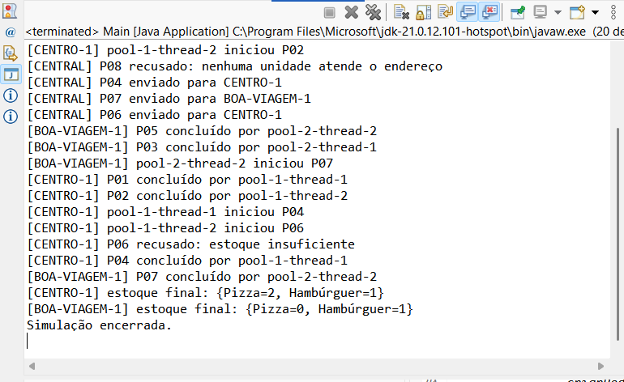

# FilaFood

Protótipo acadêmico de um sistema de distribuição de pedidos entre unidades de uma rede de restaurantes.

## Objetivo da Parte 1

Executar em um único computador uma simulação na qual vários clientes enviam pedidos ao mesmo tempo. O servidor central escolhe uma unidade que atende o endereço e encaminha o pedido para sua fila.

## Arquitetura atual

```text
Clientes simultâneos (ExecutorService)
                |
                v
        ServidorCentral
                |
        escolhe pela região
                |
       +--------+--------+
       |                 |
 Restaurante Centro  Restaurante Boa Viagem
 BlockingQueue       BlockingQueue
       |                 |
 ExecutorService     ExecutorService
       |                 |
 Estoque synchronized   Estoque synchronized
```

- `ItemPedido`: nome e quantidade de um item.
- `Pedido`: identificador, cliente, endereço e itens.
- `ServidorCentral`: seleciona uma unidade disponível que atende o endereço.
- `Restaurante`: mantém uma fila segura e trabalhadores concorrentes.
- `Estoque`: verifica e retira itens dentro de métodos `synchronized`.
- `Main`: cria os dados e simula oito pedidos chegando simultaneamente.
- `CenarioDeCarga`: cenário de carga que confere as invariantes de desfecho e falha se alguma quebrar.

## Concorrência e sincronização

Os pedidos dos clientes são enviados por um `ExecutorService` com quatro threads. Cada restaurante usa outro `ExecutorService` com duas threads para processar sua `BlockingQueue`.

O risco principal é duas threads consultarem e alterarem o mesmo estoque ao mesmo tempo. Sem sincronização, ambas poderiam enxergar a mesma quantidade e vender mais itens do que existem. O método `reservar` é `synchronized`, portanto apenas uma thread por vez executa a verificação e a retirada dos itens.

A `LinkedBlockingQueue` foi escolhida porque já é uma fila segura para uso por várias threads. Não foi criado um bloqueio manual para a fila.

Outros riscos e decisões:

- **Encerramento:** o recebimento e a mudança do estado `aberto` usam o mesmo monitor do restaurante. Assim, um pedido não pode ser aceito depois que os trabalhadores começam a encerrar. Quando o prazo de espera se esgota, `encerrar` ainda esvazia a fila com `drainTo` e registra cada pedido restante como cancelado, para que nenhum pedido aceito fique sem desfecho.
- **Contabilidade dos pedidos:** cada unidade mantém contadores atômicos de aceitos, concluídos, recusados e cancelados, e imprime o balanço ao encerrar. A invariante `aceitos = concluídos + recusados + cancelados` é verificada pelo cenário de carga.
- **Encerramento de várias unidades:** `Main` fecha as unidades em laço, com `try/catch` por unidade, e restaura o sinal de interrupção da thread principal no fim. Assim, uma interrupção ao fechar a primeira unidade não deixa a segunda aberta — o que manteria a JVM viva, já que os pools não são daemon.
- **Interrupção:** se um trabalhador for interrompido depois de reservar os itens, o pedido é cancelado e os itens são devolvidos ao estoque.
- **Erros escondidos:** o programa guarda os `Future` dos clientes e chama `get()`, permitindo que uma falha seja propagada para a thread principal.
- **Lista de restaurantes:** é preenchida antes do início dos clientes e não é alterada durante a simulação.
- **Deadlock:** o servidor central pode adquirir seu monitor e depois o monitor do restaurante ao encaminhar um pedido. Não existe o caminho inverso, do restaurante para o servidor central, portanto o fluxo atual não forma espera circular.
- **Fila sem limite:** a `LinkedBlockingQueue` atual é ilimitada. Isso é suficiente para os oito pedidos da demonstração, mas uma versão real deveria limitar a capacidade para aplicar backpressure.
- **Seleção da unidade:** nesta demonstração existe uma unidade por região. A menor fila já é considerada pelo servidor para permitir que outras unidades sejam adicionadas depois.

### Risco encontrado em teste: pedidos aceitos sem desfecho

A primeira versão do encerramento esperava até dez segundos e, esgotado esse prazo, chamava `shutdownNow()`. Os pedidos, porém, não são tarefas do executor: ficam na `BlockingQueue` da unidade. Por isso a lista devolvida por `shutdownNow()` não os recupera, e os que continuavam na fila ficavam sem consumidor — descartados sem nenhum registro, mesmo já tendo sido confirmados ao cliente.

O problema não aparece na demonstração de oito pedidos, porque a fila sempre esvazia dentro do prazo. Ele foi encontrado com um teste de carga de 120 pedidos: 120 aceitos e apenas 110 com algum desfecho registrado. A quantidade perdida varia entre execuções, porque depende do escalonamento das threads.

A correção esvazia a fila com `drainTo` depois que os trabalhadores param e registra cada pedido restante como cancelado. A drenagem é segura sem trava adicional porque, nesse ponto, `aberto` já é `false` e `receber` é `synchronized` no mesmo monitor: nenhum pedido novo consegue entrar enquanto a fila é esvaziada. Esses pedidos também não devolvem estoque, porque nunca chegaram a reservá-lo — só o pedido interrompido durante o preparo devolve.

Depois da correção, o mesmo teste registra 120 pedidos com desfecho e nenhum sem rastro. O cenário está versionado em `CenarioDeCarga.java`, então a verificação é reproduzível.

O servidor sincroniza somente a decisão rápida de roteamento. O preparo dos pedidos continua acontecendo paralelamente nos restaurantes.

## Comunicação e dados

Nesta etapa single-node, a comunicação entre o servidor central e os restaurantes acontece por chamadas de métodos Java. O arquivo `src/main/proto/pedido.proto` registra o contrato gRPC planejado para a evolução distribuída.

O método `EnviarPedido` é unário: recebe um `PedidoRequest` e devolve um `PedidoResponse`. Essa escolha é suficiente porque cada pedido gera uma única confirmação.

O `PedidoRequest` contém `pedido_id`, `cliente`, `endereco` e uma lista de itens com `nome` e `quantidade`. O `PedidoResponse` informa `recebido`, `restaurante_id` e `status`. Protobuf define os campos e tipos do contrato.

gRPC foi escolhido para a futura comunicação interna entre o servidor central e as unidades porque oferece um contrato explícito no arquivo `.proto`, geração de código e mensagens compactas. REST continuaria adequado para uma API pública acessada por navegador ou aplicativo, mas não é necessário no enlace interno desta etapa.

As dependências e o plugin do gRPC ainda não foram adicionados. Assim, esta primeira versão continua pequena e executável somente com Java.

## Como executar no Eclipse

### Simulação padrão

1. Abra `Main.java`.
2. Clique com o botão direito no arquivo.
3. Escolha **Run As > Java Application**.
4. Observe pedidos sendo processados por threads diferentes e pedidos recusados por endereço ou falta de estoque.

### Cenário de carga

Abra `CenarioDeCarga.java` e execute da mesma forma. A classe não usa biblioteca de teste: ela mesma confere as invariantes e lança `IllegalStateException` se alguma falhar. São dois cenários, ambos com duas unidades, dois trabalhadores cada e oito threads de clientes:

- 16 pedidos, que cabem no prazo de encerramento;
- 120 pedidos, que ultrapassam esse prazo e forçam a drenagem da fila.

O cenário leve passa mesmo com o defeito anterior presente, porque a fila esvazia sozinha; é o cenário pesado que impede o regresso.

## Decisões tomadas

- Aceita: Java 21 e Maven, porque Java é usado nas disciplinas e Maven permitirá adicionar gRPC depois.
- Aceita: `ExecutorService`, por controlar um conjunto pequeno de threads sem criar cada thread manualmente.
- Aceita: `LinkedBlockingQueue`, por ser uma fila pronta e segura para concorrência.
- Aceita: `synchronized` no estoque, por proteger a seção crítica com uma solução ensinada em aula.
- Rejeitada nesta etapa: Spring Boot, porque não é necessário para o protótipo local de concorrência.
- Aceita: `AtomicInteger` nos contadores de desfecho, por permitir soma segura entre threads sem abrir um bloco sincronizado apenas para isso.
- Aceita: drenar a fila em `encerrar` e registrar os pedidos restantes como cancelados, para que nenhum pedido aceito fique sem desfecho.
- Rejeitada: imprimir o log de encaminhamento antes de `fila.offer`. Numa fila com capacidade limitada, isso anunciaria "enviado" para um pedido que a fila viesse a recusar.
- Adiada: execução real de gRPC, porque primeiro será validado o comportamento single-node.

## Uso de IA nesta etapa

A IA foi usada como copiloto para organizar a estrutura Maven, propor um protótipo mínimo e revisar riscos de concorrência. A equipe deve executar o programa, estudar cada classe e registrar dúvidas ou mudanças antes da apresentação.

Os prompts, decisões aceitas ou adiadas e suas justificativas estão registrados em `DIARIO-IA.md`.

## Evidências

- [Captura da execução](evidencias/execucao-filafood.png)
- `CenarioDeCarga.java` — evidência reproduzível: qualquer pessoa executa e confere as invariantes de desfecho.
- [Diário de uso da IA](DIARIO-IA.md)


