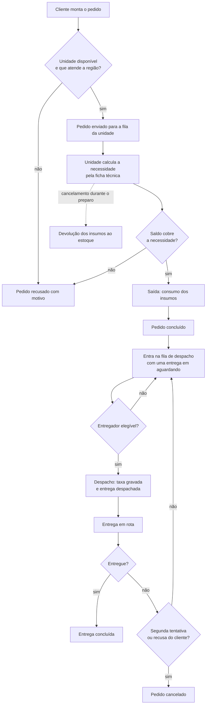

# FilaFood: descrição do domínio e linguagem onipresente

> **Nível preliminar do DDD.** Este documento fixa o vocabulário do domínio antes da modelagem
> (Context Mapper) e antes do código. Ele é a fonte da verdade para nomes de classes, campos,
> telas, cenários BDD e mensagens do sistema.
>
> **Status:** rascunho produzido com apoio de IA, pendente de revisão do grupo.

## 1. O domínio

FilaFood é uma rede de unidades de restaurante que atende pedidos por região de entrega.

O cliente monta um pedido informando o endereço de entrega e os itens desejados. O sistema escolhe
uma unidade disponível que atenda aquela região e encaminha o pedido para a fila dela. A unidade prepara
o pedido consumindo os insumos do próprio estoque, segundo a ficha técnica dos produtos vendidos.
Quando o pedido fica pronto, ele entra na fila de despacho e um entregador o leva até o cliente.

O domínio se organiza em quatro preocupações:

1. **Operação da unidade**: quem atende, o que está aberto e quem trabalha ali.
2. **Pedido do cliente**: montar, enviar, acompanhar e cancelar.
3. **Produção e suprimento**: transformar produtos vendidos em consumo de insumos e repor o que falta.
4. **Entrega**: despachar, entregar e registrar o desfecho de cada entrega.

## 2. Atores

| Ator | O que faz |
|---|---|
| **Cliente** | Monta o pedido, envia, acompanha o andamento e cancela enquanto permitido. |
| **Administrador da rede** | Cadastra, consulta, altera, desativa, reativa, pausa e retoma o recebimento das unidades, e mantém o cardápio da rede. |
| **Gestor da unidade** | Mantém os cadastros da própria unidade: funcionários, insumos, ficha técnica, zonas de entrega e entregadores. |
| **Atendente ou cozinheiro** | Recebe o pedido, inicia o preparo, conclui, cancela ou recusa. |
| **Entregador** | Registra a retirada, a entrega ou a falha. |

## 3. Linguagem onipresente

Esta é a lista de termos aceitos. A coluna **"não usar"** registra os nomes alternativos do
conceito que foram descartados: eles não podem nomear o conceito em documento, tela ou código
**novos**. A palavra descartada continua livre em outros sentidos, e o termo aceito prevalece
quando ela faz parte dele.

### 3.1 Organização

| Termo | Definição | Não usar |
|---|---|---|
| **Unidade** | Ponto de atendimento da rede, com região de atendimento e estoque próprios. | loja, filial, franquia |
| **Ativa** | Estado cadastral da unidade. Unidade inativa não recebe pedidos e seu cadastro é preservado. | habilitada, ligada |
| **Disponível** | Unidade que está **ativa** e **recebendo pedidos**. Apenas unidade disponível pode receber pedido. | aberta, livre, on-line |
| **Pausa** | Interrupção temporária do recebimento de pedidos de uma unidade ativa. | suspensão, bloqueio, fechamento |
| **Motivo de pausa** | Justificativa obrigatória, de até 200 caracteres, registrada ao pausar uma unidade. | observação, comentário |
| **Região de atendimento** | Área geográfica declarada por uma unidade, na qual ela aceita pedidos. Atributo **da unidade**, distinto da **zona de entrega**. | área de cobertura, setor, bairro |
| **Funcionário** | Pessoa vinculada a uma unidade, com uma função. Permanece consultável mesmo quando inativo. | empregado, colaborador, usuário |
| **Função** | Papel do funcionário: `administrador`, `gestor`, `atendente` ou `cozinheiro`. | cargo, posição, perfil |

### 3.2 Cardápio e produção

| Termo | Definição | Não usar |
|---|---|---|
| **Produto** | Item do cardápio da rede, vendido ao cliente dentro de um pedido. | prato, mercadoria, item |
| **Item do pedido** | Linha de um pedido: um produto e sua quantidade. | item, linha, entrada |
| **Ficha técnica** | Composição que define quais insumos, e em que quantidade, um produto consome no preparo de uma porção em uma unidade. É o que liga **produto** a **insumo**. | receita, composição, BOM |
| **Item da ficha técnica** | Linha da ficha técnica: um insumo e a quantidade consumida por porção. | linha, ingrediente |
| **Unidade de medida** | Unidade em que um insumo é controlado (kg, L, un). | métrica, medida |

### 3.3 Pedido

| Termo | Definição | Não usar |
|---|---|---|
| **Cliente** | Pessoa que monta, envia e acompanha pedidos. | usuário, consumidor, sócio |
| **Pedido** | Solicitação de um cliente, com um endereço de entrega e um ou mais itens, que percorre estados até um desfecho. | ordem, solicitação, requisição |
| **Região de entrega** | Área do endereço de entrega do pedido, comparada com a região de atendimento para escolher a unidade que o atende. | endereço, bairro, área |
| **Rascunho** | Estado do pedido ainda editável, que não foi enviado a nenhuma unidade. | carrinho, pendente |
| **Enviado** | Pedido aceito por uma unidade e aguardando o início do preparo. É o único estado em que o cliente pode cancelar. | aceito, recebido |
| **Em preparo** | A unidade já consumiu os insumos e está produzindo o pedido. | preparando, em produção |
| **Concluído** | O pedido foi produzido e seguiu para a entrega. Não é desfecho: o pedido fica concluído enquanto a entrega corre, e passa a cancelado se ela falhar sem nova tentativa. | finalizado, pronto, entregue |
| **Recusado** | Desfecho em que o pedido não chegou a ser preparado, por nenhuma unidade atender a região ou por falta de saldo de insumo, sempre com **motivo de recusa** registrado. | rejeitado, negado |
| **Cancelado** | Desfecho: o pedido foi interrompido pelo cliente, pela unidade ou pelo sistema. O sistema cancela quando a entrega falha sem nova tentativa. | abortado, estornado |
| **Motivo de recusa** | Justificativa obrigatória registrada quando um pedido é recusado. | erro, observação |

São **desfechos** do pedido apenas `recusado` e `cancelado`. `concluído` e os estados anteriores
descrevem a produção; a fase de entrega é acompanhada pelo **estado da entrega**, e o pedido
permanece `concluído` enquanto ela corre.

### 3.4 Estoque

| Termo | Definição | Não usar |
|---|---|---|
| **Insumo** | Material consumido na produção de um produto, mantido por uma unidade. Tem unidade de medida, estoque mínimo e prazo de entrega em dias. | matéria-prima, ingrediente |
| **Estoque** | Conjunto dos insumos mantidos por uma unidade, com os saldos respectivos. | depósito, almoxarifado |
| **Saldo** | Soma das entradas menos a soma das saídas de um insumo. | quantidade em estoque |
| **Compra** | Aquisição de insumos pelo gestor, que gera uma **entrada** de estoque. Nunca se refere ao pedido do cliente. | aquisição, pedido de compra |
| **Movimentação de estoque** | Registro **imutável** de alteração de saldo: é de entrada, quando soma, ou de saída, quando subtrai. | transação, lançamento |
| **Entrada** | Movimentação que soma ao saldo. Motivos: compra e devolução. | recebimento |
| **Saída** | Movimentação que subtrai do saldo. Motivo: consumo na produção. | baixa |
| **Devolução** | Motivo de entrada que recompõe o saldo quando um preparo é cancelado. | estorno, retorno |
| **Consumo** | Saída gerada pelo preparo de um pedido, calculada pela ficha técnica. | baixa, gasto |
| **Reposição** | Conjunto das regras de ponto de pedido e sinalização de insumo a repor. | ressuprimento, reabastecimento |
| **Estoque mínimo** | Quantidade que a unidade mantém como reserva. | estoque de segurança |
| **Consumo médio diário** | Média das saídas de um insumo nos últimos 30 dias, dividida por 30. | média de consumo, giro |
| **Ponto de pedido** | Consumo médio diário × prazo de entrega em dias + estoque mínimo. | ponto de ressuprimento |
| **Custo unitário** | Valor pago por uma unidade de medida do insumo, informado na **entrada por compra** e gravado na movimentação. O custo médio de estoque está fora de escopo. | preço |
| **A repor** | Estado de um insumo cujo **saldo** está menor ou igual ao ponto de pedido. | crítico, acabando, baixo |

### 3.5 Entrega

| Termo | Definição | Não usar |
|---|---|---|
| **Entregador** | Pessoa que transporta pedidos de uma unidade até o cliente. Tem zonas atendidas, carga máxima e estado `ativo` ou `inativo`. | motoboy, driver, moto |
| **Zona de entrega** | Área definida por centro e raio, com valor base, raio gratuito, valor por quilômetro, teto e valor mínimo de pedido. Delimita a **taxa de entrega** e é distinta da região de atendimento. | área, região, setor |
| **EnderecoEntrega** | Endereço de entrega de um pedido, com a **região de entrega** e as coordenadas. A região escolhe a unidade; as coordenadas determinam a **zona de entrega**. | destino, local |
| **Carga máxima** | Número máximo de entregas simultâneas de um entregador. | capacidade, limite |
| **Taxa de entrega** | Valor cobrado pelo deslocamento, calculado pela zona e gravado na entrega no momento do despacho. | frete, valor de entrega |
| **Despacho** | Ato de escolher um entregador para um pedido pronto. | atribuição, designação |
| **Fila de despacho** | Conjunto de pedidos prontos que ainda não têm entregador. | pendências, backlog |
| **Entrega** | O deslocamento de um entregador para levar um pedido ao cliente. É criada em `aguardando` quando o pedido pronto entra na fila de despacho, recebe a **taxa** no despacho e termina em um desfecho. | corrida, rota, viagem |
| **Falha** | Desfecho em que a entrega não foi concluída, com motivo e observação registrados. | ocorrência, incidente, problema |

### 3.6 Estados

Nomes de estado aceitos no sistema, reunidos aqui para que não exista sinônimo entre telas.

| Termo | Definição | Não usar |
|---|---|---|
| **Estado da unidade** | `ativa` ou `inativa`, no cadastro, e `disponível` ou `pausada`, no recebimento. | status, situação |
| **Estado do funcionário** | `ativo` ou `inativo`. | status, situação |
| **Estado do insumo** | `normal` ou `a repor`. | status, situação |
| **Estado do entregador** | `ativo` ou `inativo`. | status, situação |
| **Estado do pedido** | `rascunho`, `enviado`, `em preparo`, `concluído`, `recusado`, `cancelado`. | status, situação |
| **Estado da entrega** | `aguardando`, `despachada`, `em rota`, `entregue`, `falha`. | status, situação |

### 3.7 Correspondência com o protótipo da Parte 1

O protótipo de console em `src/main/java` foi escrito antes deste documento e usa nomes próprios.
Ele não será alterado, porque é a entrega daquela etapa. Esta tabela serve de tradução entre os
dois vocabulários.

| No protótipo (`src/main/java/br/edu/cesar/filafood/`) | Termo do domínio |
| --- | --- |
| `Restaurante` | Unidade |
| `Restaurante.regiao` | Região de atendimento |
| `Restaurante.aberto` | Disponível |
| `Restaurante.fila` | Fila de pedidos da unidade |
| `Restaurante.receber(Pedido)` | Recebimento do pedido pela unidade |
| `ServidorCentral.enviarPedido` | Seleção de unidade e encaminhamento do pedido |
| `Pedido.cliente` | Cliente |
| `Pedido.endereco` | Endereço de entrega do pedido, que carrega a região de entrega |
| `Pedido.itens` e `ItemPedido` | Itens do pedido |
| `ItemPedido.nome` | Produto |
| `Estoque` | Estoque da unidade |
| `Estoque.reservar(Pedido)` e `Estoque.devolver(Pedido)` | Saída e Devolução |
| `CenarioDeCarga` | Não é do domínio, é cenário de teste |

Três diferenças de modelagem entre o protótipo e este documento também não exigem alterar o
protótipo:

1. O protótipo controla **produtos** direto no `Estoque` (retira "Hambúrguer", "Pizza"). O projeto
   separa **produto** (o que se vende) de **insumo** (o que se consome) e liga os dois pela
   **ficha técnica**.
2. O protótipo não representa o **estado do pedido**: o `Pedido` é imutável e o desfecho só existe
   nos contadores de cada unidade.
3. O protótipo não tem os cadastros de unidade, funcionário, insumo, ficha técnica, entregador e
   zona de entrega, e as duas unidades são criadas direto no `Main`.

## 4. Termos que se confundem

Estes pares já causaram ambiguidade na documentação das funcionalidades. Ficam resolvidos aqui:

| Par | Como distinguir |
|---|---|
| **Pedido** × **Compra** | Pedido é do **cliente** e contém produtos. A **compra** é o motivo de uma entrada de insumos, feita pelo gestor. A palavra compra nunca se aplica ao pedido do cliente. |
| **Produto** × **Insumo** | Produto é o que se **vende**. Insumo é o que se **consome** para produzir. A ficha técnica é a única ponte entre os dois. |
| **Região de atendimento** × **Zona de entrega** | Região é da **unidade** e diz onde ela aceita pedidos. Zona é da **entrega** e diz quanto se cobra pelo deslocamento. Uma unidade pode atender uma região e ainda assim ter entregas em várias zonas. |
| **Funcionário** × **Entregador** | Entregador é uma pessoa que transporta pedidos. Quando também for funcionário da unidade, são dois cadastros ligados, não um cadastro com dois nomes. |

## 5. Fluxos principais

### 5.1 Do pedido à baixa de insumos

### 5.2 Da venda à reposição

1. A venda gera **saídas** de estoque, por insumo, através da ficha técnica.
2. As saídas dos últimos 30 dias alimentam o **consumo médio diário**.
3. O consumo médio, o prazo de entrega do insumo e o estoque mínimo definem o **ponto de pedido**.
4. Quando o **saldo** cai até o ponto de pedido, o insumo fica **a repor** e aparece como tal na tela de insumos.

### 5.3 Cadastros de apoio

Unidade, funcionário, produto, insumo, ficha técnica, zona de entrega e entregador são mantidos
pelos papéis de administração. São insumos de dados para os fluxos acima.

## 6. Fora de escopo

Declarado explicitamente para evitar expectativa errada:

- Pagamento, faturamento e nota fiscal.
- Rastreamento do entregador em tempo real.
- Avaliação de pedidos e de entregadores.
- Aplicativo móvel nativo.
- Integração real com mapas ou com API de distância. O cálculo usa coordenadas e distância em linha reta.
- Lote, validade, vencimento e custo médio de estoque.
- Perda e ajuste de inventário.
- Retirada do pedido na unidade, agrupamento de pedidos em uma mesma entrega e turno por entregador.

## 7. Regra de uso do vocabulário

1. Se o termo não está na seção 3, ele não é do domínio. Discuta antes de usar.
2. Se o termo está na coluna "não usar", ele não pode nomear aquele conceito em documento,
   tela ou código **novos**. Em outros sentidos, a palavra continua livre.
3. A linguagem onipresente vale para o **código novo** do projeto web: nomes de classes, métodos,
   campos, tabelas e colunas.
4. O protótipo da Parte 1 **não será renomeado**. Ele permanece com os nomes que já tem, e a
   correspondência está na seção 3.7.
5. Ao encontrar um termo novo, ele entra **aqui primeiro** e só depois no código.
6. Grandezas calculadas por uma regra, como a **necessidade** da funcionalidade 1, ficam definidas
   no bloco "Definições usadas nas regras" da própria funcionalidade e não entram na seção 3.
